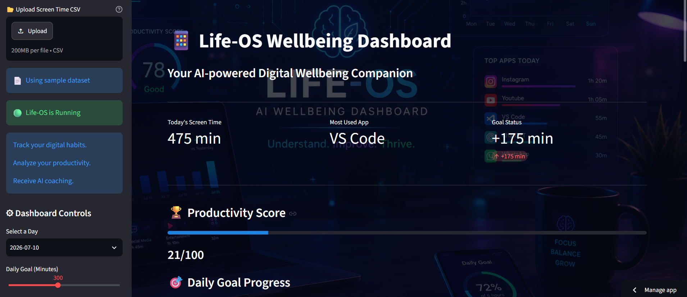
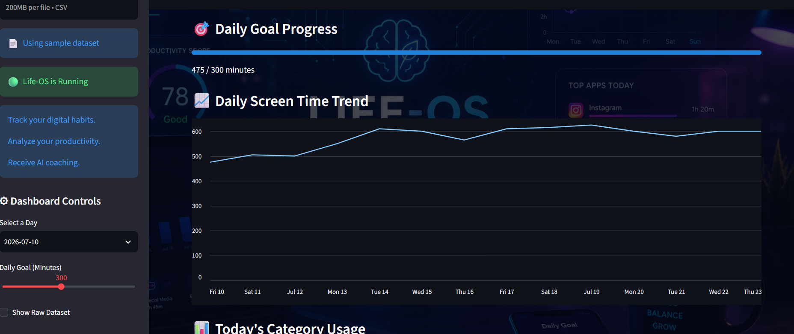
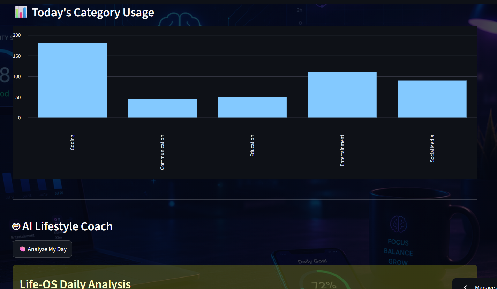
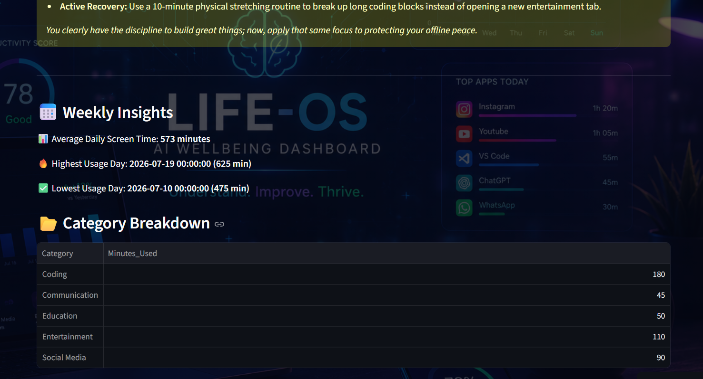

# 📱 Life-OS: AI Wellbeing Dashboard

> **An AI-powered digital wellbeing dashboard that transforms screen time data into personalized productivity insights using Google Gemini.**


---

## 📖 Overview

**Life-OS** is an intelligent digital wellbeing dashboard built with **Streamlit**, **Pandas**, and **Google Gemini AI**.

The application analyzes daily screen time habits, visualizes usage patterns, evaluates productivity, and provides personalized lifestyle coaching. It also generates an AI-powered motivational avatar based on the user's digital behavior.

Designed as part of the **MirAI School of Technology – AI Builder Track Capstone Project**, the dashboard demonstrates practical skills in data visualization, prompt engineering, AI integration, and modern Python application development.

---

# ✨ Features

* 📊 Interactive analytics dashboard
* 📅 Filter screen time by date
* 🎯 Adjustable daily screen-time goal
* 📈 Daily usage trend visualization
* 📊 Category-wise screen-time analysis
* 🏆 Productivity Score
* 📅 Weekly Insights
* 🤖 AI-powered lifestyle coaching using Google Gemini
* 🎭 Dynamic AI Productivity Avatar
* 📂 Upload your own Screen Time CSV
* 📄 Built-in sample dataset for quick testing
* 💻 Responsive Streamlit interface

---

# 🖼 Dashboard Preview










---

# 🛠 Tech Stack

| Technology        | Purpose               |
| ----------------- | --------------------- |
| Python            | Programming Language  |
| Streamlit         | Dashboard UI          |
| Pandas            | Data Processing       |
| Google Gemini API | AI Lifestyle Coach    |
| python-dotenv     | Environment Variables |
| Requests          | Avatar Image API      |

---

# 📂 Project Structure

```text
Life-OS-AI-Wellbeing-Dashboard/
│
├── app.py
├── ai_coach.py
├── utils.py
├── screentime.csv
├── requirements.txt
├── README.md
├── .gitignore
├── .env
│
└── assets/
```

---

# 🚀 Installation

## Clone the Repository

```bash
git clone https://github.com/YOUR_USERNAME/Life-OS-AI-Wellbeing-Dashboard.git
cd Life-OS-AI-Wellbeing-Dashboard
```

---

## Create a Virtual Environment

```bash
python -m venv venv
```

### Windows

```powershell
.\venv\Scripts\activate
```

### macOS/Linux

```bash
source venv/bin/activate
```

---

## Install Dependencies

```bash
pip install -r requirements.txt
```

---

## Configure Environment Variables

Create a `.env` file:

```env
GEMINI_API_KEY=YOUR_API_KEY
```

---

## Run the Application

```bash
streamlit run app.py
```

---

# 📊 CSV Format

The dashboard accepts CSV files with the following columns:

| Column       | Description          |
| ------------ | -------------------- |
| Date         | Usage Date           |
| App_Name     | Application Name     |
| Category     | App Category         |
| Minutes_Used | Time Spent (Minutes) |

Example:

```csv
Date,App_Name,Category,Minutes_Used
2026-07-23,Instagram,Social Media,90
2026-07-23,VS Code,Coding,210
2026-07-23,ChatGPT,Education,45
```

---

# 🤖 AI Lifestyle Coach

Google Gemini analyzes the selected day's screen-time data and provides:

* Digital habit analysis
* Productivity evaluation
* Biggest distraction
* Positive habits
* Practical offline activity suggestions
* Personalized motivation

Instead of generic advice, the AI recommends meaningful real-world activities such as:

* 📚 Reading
* 🏃 Exercise
* 🍳 Meal preparation
* 👨‍👩‍👧 Family time
* 🧘 Meditation

---

# 🎭 Innovation Feature

## AI Productivity Avatar

The dashboard generates a dynamic visual representation of the user's digital habits.

Examples:

* 📱 Excessive screen time → humorous "digital zombie" style avatar
* 💪 Balanced usage → productive and focused avatar

This feature enhances engagement while encouraging healthier digital habits.

---

# 📂 Custom Data Upload

Users can upload their own compatible screen-time CSV to receive personalized analytics and AI coaching.

If no file is uploaded, the application automatically loads the included sample dataset.

---

# 🎯 Learning Outcomes

This project demonstrates:

* Data Visualization
* Pandas Data Analysis
* Streamlit Dashboard Development
* Prompt Engineering
* Google Gemini API Integration
* UI/UX Design
* Python Project Architecture
* AI-assisted Productivity Applications

---

# 🌐 Live Demo

**Streamlit App**

```
https://life-os-ai-wellbeing.streamlit.app/
```

---

# 💻 GitHub Repository

```
https://github.com/mohamedathif040-netizen/Life-OS-AI-Wellbeing-Dashboard
```

---

# 📌 Future Improvements

* 📱 Android Digital Wellbeing integration
* 🍎 Apple Screen Time import
* 📊 Pie charts and advanced analytics
* 🔔 Daily reminders
* 📈 Weekly productivity reports
* ☁️ Cloud database support
* 👤 User authentication
* 📅 Habit streak tracking

---

# 👨‍💻 Author

**Mohamed Athif**

AI Builder Intern • Python Developer • Streamlit Enthusiast

---

# 📄 License

This project is developed for educational and portfolio purposes as part of the **MirAI School of Technology Virtual Summer Internship 2026**.

---

## ⭐ If you found this project interesting, consider giving it a Star!
